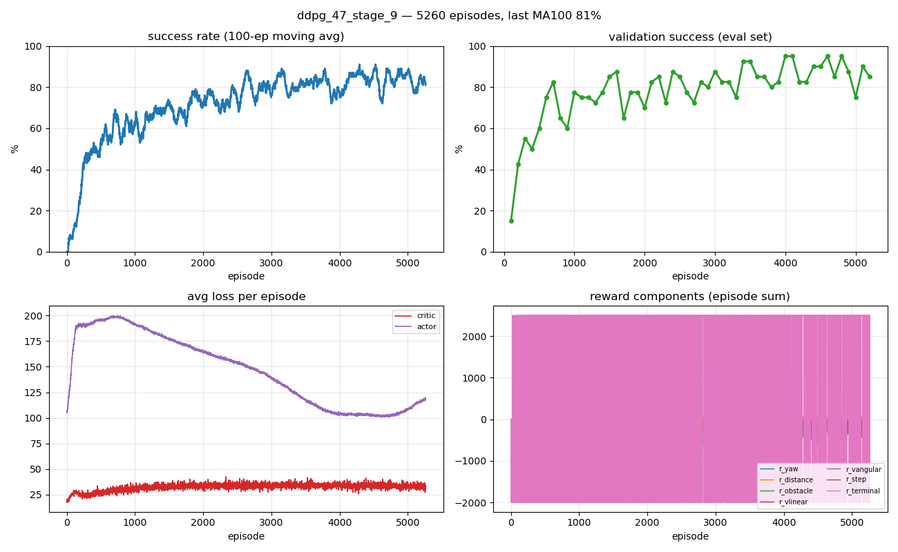
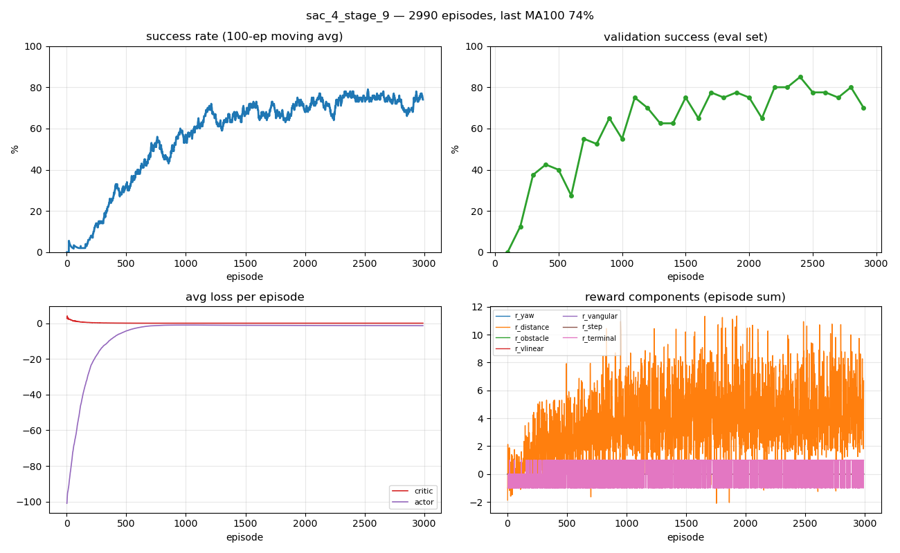
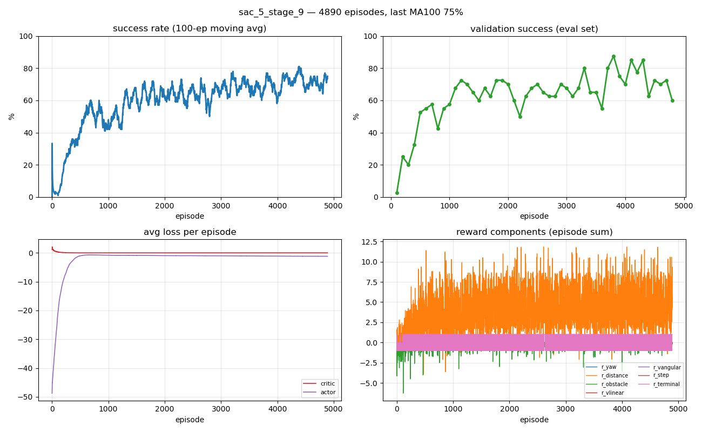

# Experiments: Reference Replication (DDPG) & Reward Shaping (SAC)

TurtleBot3 goal navigation among **6 moving obstacles**  stage 9 ROS 2 + Gazebo.

**Reference = upstream implementation**
([`prakash-aryan/turtlebot3_deepRL`](https://github.com/prakash-aryan/turtlebot3_deepRL),
`tomasvr/turtlebot3_drlnav`).        

Its trained agents scored on the *same* benchmark below **DDPG 84% · SAC 82%**.

## Evaluation

All accuracies are the **standard `test_agent` benchmark**: **100 random-goal episodes**, deterministic
policy. 
Episode = `SUCCESS` (<0.20 m) / `COLLISION` / `TIMEOUT` (50 s).

## Results

| Algorithm | Config | Best ckpt | **test_agent (100 eps)** | Reference |
|---|---|---|---|---|
| **DDPG** | reference dense reward | ep4000 | **89%** | 84% |
| **SAC**  | **reward V (ours)** | ep4700 | **84%** | 82% |

Both **beat the reference**. SAC (Part 2) is the novel contribution and only works because of the reward
shaping — the reference dense reward made SAC collapse.

---

# Part 1 — Reference replication (DDPG)

We reproduced the reference DDPG with its exact config. This checks that our setup matches the reference before we change anything.

The reward-shaping pipeline (S→P→O→V) was first tried on DDPG, then moved to SAC in Part 2.

### DDPG — **89%** (reference 84%)

Config: `lr 3e-4, tau 3e-3, batch 256, hidden 512, reward A`.

Result: 89% success, 9% wall, 2% timeout.

---

# Part 2 — SAC reward shaping

The reference dense reward makes SAC collapse. It learns to spin in place and time out (~55–65%). With the big `−2000` collision penalty, hiding is safer than going for the goal.

So I rebuilt the reward from a simple sparse base.

| Reward | Idea | **test_agent best** | Trajectory | Outcome |
|---|---|---|---|---|
| A (reference dense) | `±2500/−2000` + dense penalties | ~55–65% *(collapses)* | — | Spin / timeout |
| **P** (sparse + progress) | `±1` + potential-based progress `K·Δdist` | **77%** (ep1900) | 72 / **77** / 72 / 71 | Timeouts 58%→~1% |
| **V** (P + speed×proximity penalty) | penalize *fast-and-close* to obstacles | **84%** (ep4700) | 66 / 83 / **84** | Wall rate 25%→15% |

- **P** (`exp002`): a reward for getting closer to the goal, `r = clip(K·(prev_dist − dist), ±1)`. This is potential-based shaping (Ng et al. 1999): it can't be gamed and keeps the best policy unchanged. It gives the goal direction that pure sparse lacked.
- **V** (`exp004`): P plus a penalty for being **fast and close** to an obstacle. This targets the main failure, hitting a wall while driving fast, without punishing slow careful moves.

### SAC reward P (77%)

### SAC reward V (84%, the winner)

### SAC vs reference

**Hyperparameters (both runs):** GaussianActor + twin Critic, auto-α; `hidden=512, batch=256, γ=0.99,
lr=3e-4, tau=0.005, target_entropy=−2.0`. Only the reward differs (P vs V; V adds `OBSTACLE_K=0.5,
OBSTACLE_SAFE=0.40`).

---

## Reward function reference (`drl_environment/reward.py`)

| Fn | Per-step | Terminal |
|---|---|---|
| A | dense: `−|goalΔ| − ω² + progress − [20 if d_obs<0.22] − slow-speed penalty − 1` | `+2500/−2000` |
| S | 0 (clean sparse) | `+1/−1` |
| P | `clip(K·(prev_d − d), ±1)` | `+1/−1` |
| O | P `+ [−OBSTACLE_K·prox²]` when closing inside `OBSTACLE_SAFE` | `+1/−1` |
| **V** | P `+ [−OBSTACLE_K·speed·prox]` inside `OBSTACLE_SAFE` (**winner**) | `+1/−1` |

## Narrative arc

1. Replicate the reference → **DDPG 89%** (beats 84%). Setup confirmed.
2. Switch to SAC. The dense reward → **collapses**.
3. Strip to **sparse (S)** → 0%. The goal signal is missing, not the algorithm.
4. Add **progress (P)** → **77%**.
5. Add **speed + obstacle penalty (V)** → **84%**, beats 82%.

## Artifacts (all in-repo)

| Result | Plot | Log | test_agent file |
|---|---|---|---|
| DDPG | `experiment_plots/ddpg_training.png`, `…/ddpg_vs_reference.png` | — | `experiments/replications/ddpg/test_agent_ep4000_100eps.txt` |
| SAC reward P | `experiment_plots/sac_rewardP_training.png` | `log/sac_reward_p_explore_20260606-161904.log` | `src/turtlebot3_drl/model/fond-filly/sac_4_stage_9/_test_stage9_eps1900_*.txt` |
| SAC reward V | `experiment_plots/sac_rewardV_training.png` | `log/sac_reward_v_explore_20260607-013413.log` | `src/turtlebot3_drl/model/fond-filly/sac_5_stage_9/_test_stage9_eps4700_*.txt` |
| SAC vs ref | `experiment_plots/sac_vs_reference.png` | — | `SAC/test_agent_evals.txt` |
