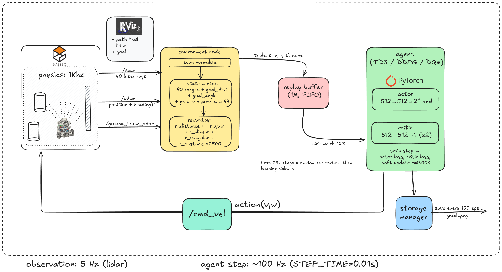
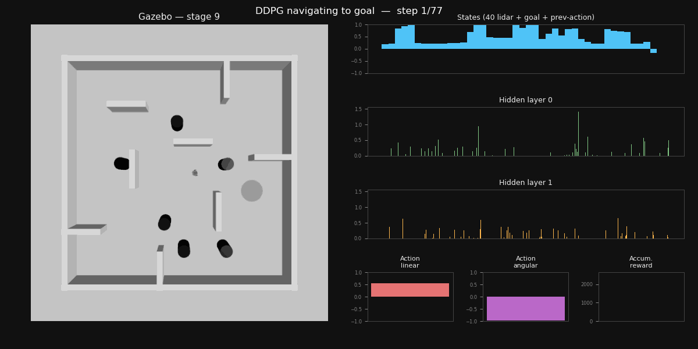

# deep-rl-robot-navigation

Deep RL for TurtleBot3 goal-navigation among 6 moving obstacles (ROS 2 + Gazebo, stage 9).
DDPG and TD3 reproduce the reference implementation; SAC is a new from-scratch contribution.


*Training pipeline — diagram by [prakash-aryan](https://github.com/prakash-aryan).*


*DDPG navigating stage 9 — left: Gazebo; right: the agent's state, both hidden layers, linear/angular
action, and accumulated reward. Visualization idea from [tomasvr/turtlebot3_drlnav](https://github.com/tomasvr/turtlebot3_drlnav).*

## Results (test_agent — 100 random-goal episodes)

| Algorithm | Test | Reference | |
|-----------|------|-----------|--|
| DDPG | **89%** | 84% | replication — [experiments/replications/](experiments/replications) |
| TD3  | **80%** | 74% | replication |
| SAC  | **84%** | 82% | new contribution — [SAC/](SAC) |

## Layout
```
SAC/                    the SAC contribution (results, configs, best weights)
experiments/
  replications/         DDPG & TD3 results
  reference_checkpoints/ reference DDPG/TD3/SAC checkpoints
src/turtlebot3_drl/     the ROS 2 package
  turtlebot3_drl/algorithms/   ddpg/ td3/ sac/ + base.py
  turtlebot3_drl/training/     live display, _metrics.tsv, training.png
  turtlebot3_drl/evaluation/   the test_agent benchmark
  turtlebot3_drl/{common,drl_environment,drl_gazebo}/
scripts/                train.sh, eval.sh
```

## Install
ROS 2 Jazzy + Gazebo Harmonic (Ubuntu 24.04) + PyTorch.
```bash
rosdep install --from-paths src --ignore-src -r -y
pip install torch numpy matplotlib pyyaml
colcon build --symlink-install && source install/setup.bash
```

## Train & evaluate
```bash
scripts/train.sh ddpg                          # DDPG (also: td3)
scripts/train.sh sac reward_v_explore          # SAC, the contribution recipe
scripts/eval.sh  <algo> <model_dir> <episode>  # test_agent, 100 episodes
```
Training prints a live line and writes `_metrics.tsv` + `training.png` to its session dir.
`test_agent` reports **success, collision rate, time-to-goal, and path efficiency**
(straight-line/actual path) — see [evaluation](src/turtlebot3_drl/turtlebot3_drl/evaluation).

## Containerized & distributed training
The full stack (ROS 2 Jazzy + Gazebo Harmonic + PyTorch) is packaged into one image, so a
reproducible run is a single command — no host ROS install.
```bash
docker compose -f docker/docker-compose.yml up train            # CPU run (also Apple-silicon, headless)
docker compose -f docker/docker-compose.yml --profile gpu up train-gpu   # NVIDIA-GPU run
k8s/sweep.sh                                                     # parallel hyperparameter sweep on k8s
```
- **Docker** — `rkaushik97/turtlebot3-drl:{cpu,cuda}`; see [docker/](docker/). CPU tag is
  multi-arch (amd64+arm64); CUDA tag carries the GPU torch wheel.
- **Kubernetes** — one pod per config, shared results volume, automated collection; see [k8s/](k8s/).

## Add a new algorithm
Same pattern SAC followed:
1. `src/turtlebot3_drl/turtlebot3_drl/algorithms/<name>/<name>.py` — your agent, subclass
   `OffPolicyAgent` (from `algorithms/base.py`); implement `get_action` and `train`.
2. Register it in `algorithms/__init__.py` (`REGISTRY`).
3. Add `<name>/config.sh` (hyperparameters); optional `<name>/experiments/*.sh` for reward/knob variants.
4. `scripts/train.sh <name>` then `scripts/eval.sh <name> …` — scored on the same benchmark as the rest.

## Credits
DDPG, TD3, and the robot/environment settings are adapted from
[prakash-aryan/turtlebot3_deepRL](https://github.com/prakash-aryan/turtlebot3_deepRL).
The network-activations visualization idea is from
[tomasvr/turtlebot3_drlnav](https://github.com/tomasvr/turtlebot3_drlnav).
