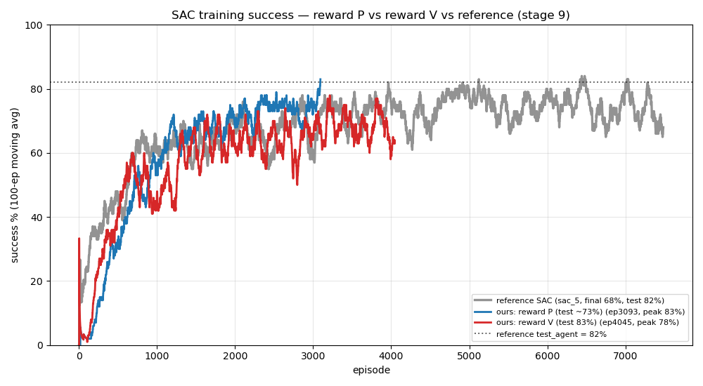

# SAC navigation (stage 9) — new contribution

Not a replication: SAC failed on the reference's reward, so this is a from-scratch SAC solution
for the moving-obstacle navigation task. Code lives in
`src/turtlebot3_drl/turtlebot3_drl/algorithms/sac/`.

## Result (test_agent, 100 random-goal eps)

| Reward | Test | |
|--------|------|--|
| reference dense (A) | ~55–65%, **collapsed** | spin-and-timeout policy |
| reward P (sparse + progress) | 77% | fixes the collapse |
| **reward V (P + obstacle penalty)** | **84%** | **beats the reference's 82%** |



## The idea
The reference's dense reward collapses SAC into a spin-and-wander policy — its huge −2000
collision penalty makes hiding (timeout) safer than committing to a goal. Two reward redesigns fix it:

- **Reward P** — sparse ±1 terminal + potential-based progress shaping, O(1) magnitudes, no
  collision cliff. The policy commits to goals (timeouts 58% → ~1%) → **77%**.
- **Reward V** — reward P + a speed-modulated obstacle penalty (penalize *fast-and-close*, not
  *near-and-slow*), so it learns to slow near walls without becoming over-cautious. Wall rate
  25% → 15% → **84%**.

SAC's policy is noisy between checkpoints, so use the validation-selected `best.pt`.

## Files
`reward_p_explore.sh`, `reward_v_explore.sh` (training configs) · best actor weights
(`…ep1900` = reward P, `…ep4700` = reward V) · `_metrics_{rewardP,rewardV}.tsv` /
`training_{rewardP,rewardV}.png` (curves) · `curve_vs_reference.png` · `test_agent_evals.txt`.

## Reproduce
```
scripts/train.sh sac reward_v_explore
scripts/eval.sh  sac <model_dir> <episode> 100
```
