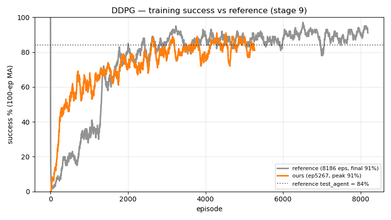
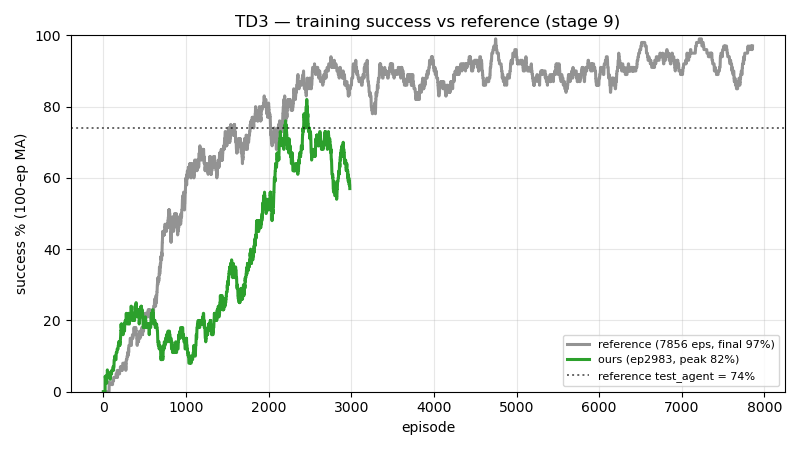
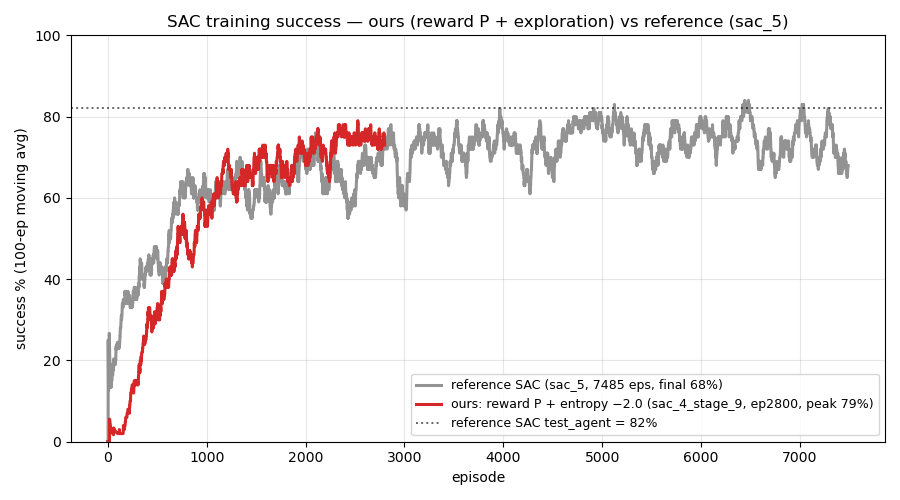

# Replications — DDPG, TD3 & SAC (stage 9)

DDPG and TD3 are faithful replications on the reference's exact config. SAC did **not** replicate
on the reference reward (it collapsed) and required a reward redesign — see `sac/README.md` for the
full diagnosis and fix. All scored on the **same benchmark** (`test_agent`, 100 random-goal
deterministic episodes).

## Replicated results

| Algorithm | Train MA100 (peak) | Val-best (40-ep, greedy) | **Test_agent (100 eps)** | Reference test | At episode |
|-----------|--------------------|--------------------------|--------------------------|----------------|------------|
| **DDPG** | 91% | 95% @ ep4000 | **89%** | 84% | 4000 (ref 8000) |
| **TD3**  | 82% | 77.5% @ ep2700 | **80%** | 74% | 2700 (ref 7400) |
| **SAC**  | 79% | 85% @ ep2400 | **77%** (reward P) | 82% | 1900 |

DDPG and TD3 **match/beat** the reference (+5pp / +6pp). **SAC** lands at **77% test** — *not* on the
reference's reward A (which collapsed SAC into a 58%-timeout policy), but on a redesigned **reward P**
(sparse + potential-based progress); it plateaus ~73–77% on a ~25% wall floor, ~5–9pp under the
reference's 82%. Full story in `sac/README.md`. The three columns measure different things:
the train MA100 is the exploring policy (noisy, exploration-inflated), the val is the greedy
policy over 40 episodes (selection-biased upward, since `best.pt` is chosen to maximize it), and
**`test_agent` is the only apples-to-apples number** vs the reference. Numbers carry ±~3.5–4.6pp
sampling noise at n=100.

## Training curves vs reference

**DDPG**



**TD3**



**SAC** (reward P — see `sac/README.md`)



## What's here
Per algorithm (`ddpg/`, `td3/`):
- `_metrics.tsv` — full per-episode training log (MA100 success, losses, reward components).
- `training.png` — 4-panel training figure (success MA100, val success, losses, reward components).
- `curve_vs_reference.png` — our training success vs the reference's, at matched episodes.
- `config.sh` — the frozen reference-exact config used to train.
- `actor_stage9_episode<E>_best.pt` — the evaluated best actor weights.
- `test_agent_ep<E>_100eps.txt` — the verified benchmark result.

## Reproduce
```
scripts/train.sh ddpg          # or td3
scripts/eval.sh  ddpg <model_dir> <episode> 100    # test_agent, 100 random-goal eps
```
See `src/turtlebot3_drl/turtlebot3_drl/evaluation/README.md` for the benchmark definition.
